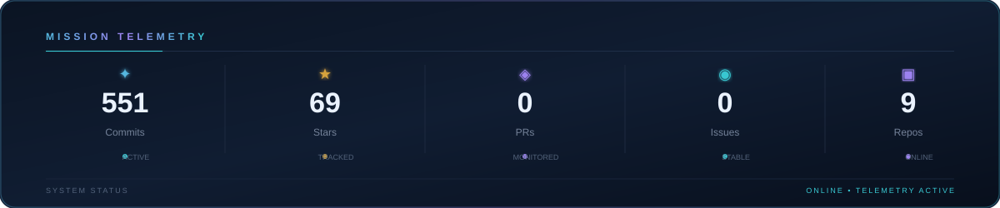
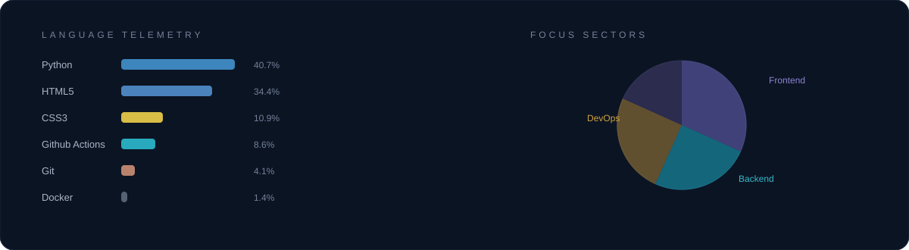
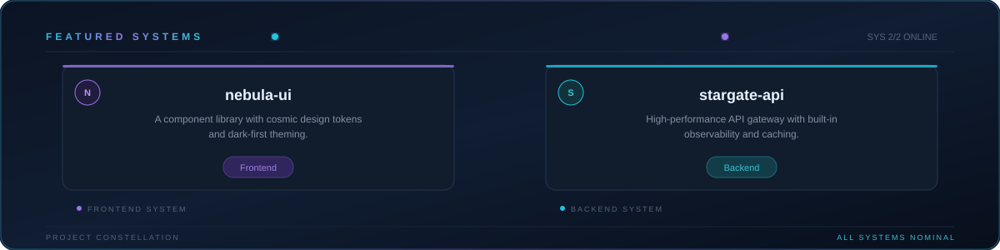

  

<table align="center">
<tr>
<td>

</td>

<td>

</td>
</tr>

<tr>
<td>

</td>

<td>

</td>
</tr>
</table>

  

  

  

    <!-- Top Bar -->
    

      

        
        
        
      

      dev-workspace.config
      ● Online
    

    <!-- Code Block -->
    

      
const developer = {

      
name: 'Mohammed',

      
college: 'IIET, Siddipet',

      
specialization: 'AI & Web Development'

      
};

    

    <!-- Stats Section -->
    

      

        
6+ Months

        
Web Application Experience

      

      

        
3rd Year

        
B.Tech

      

    

  

  <!-- Galaxy Header -->
  
   

  <!-- Mission Telemetry -->
  
   

  <!-- Tech Stack -->
  
   

  <!-- Featured Systems -->
  

## 📝 Languages & Skills

#### 🐳 Competitive Programming

- 

#### 📚 Frontend Development & Frameworks

-  

#### 🔌 Backend Development & Database Services

-   

#### ⚙️ Version Control & Documentation Tools

- 

## 📈 Contribution Stack

<a href="https://github.com/MohammedDev-yt">
<picture>
<source media="(prefers-color-scheme: dark)" srcset="https://yourinsights.vercel.app/api/insight?username=MohammedDev-yt&theme=github_dark&graph=true&languages=true&streak=true&stats=true&header=true&summary=true&profile=true">
  <source media="(prefers-color-scheme: light)" srcset="https://yourinsights.vercel.app/api/insight?username=MohammedDev-yt&theme=github_light&graph=true&languages=true&streak=true&stats=true&header=true&summary=true&profile=true">
  
  </a>
</picture>
</a>

 

---

  <h2><b>📌 PINNED REPOSITORIES</b></h2>
  

<!-- ====================  SNAKE EATING CONTRIBUTIONS  ==================== -->

<h2 align="center">🐍 Contribution Snake</h2>

  

---

<!-- ====================  QUOTE  ==================== -->

  

---

## Star History

<!-- ====================  CONNECT  ==================== -->

<h2 align="center">🤝 Connect</h2>

  
  

  

 

